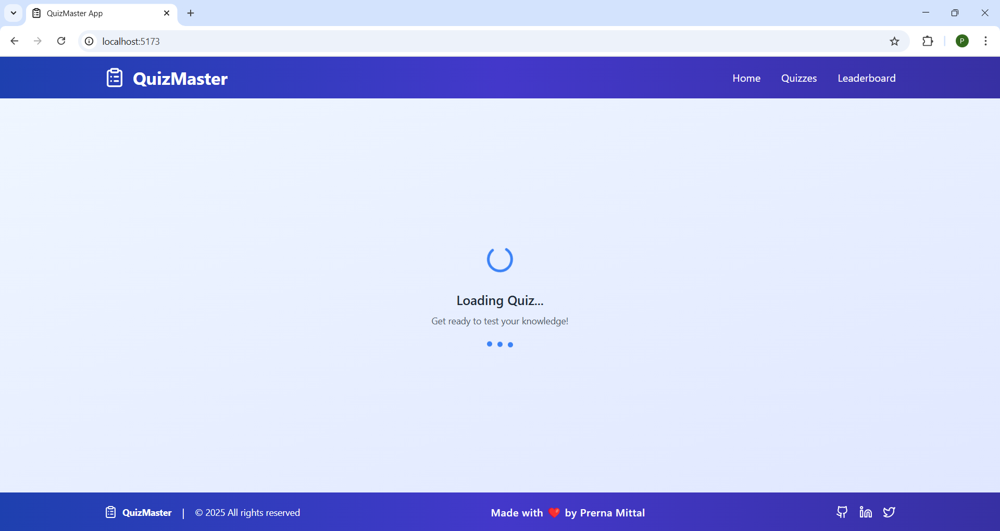
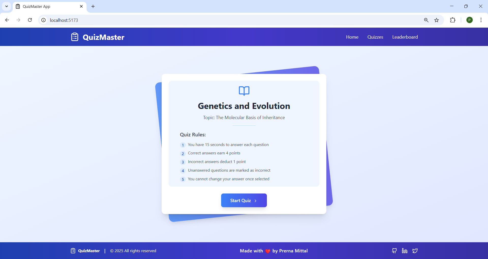
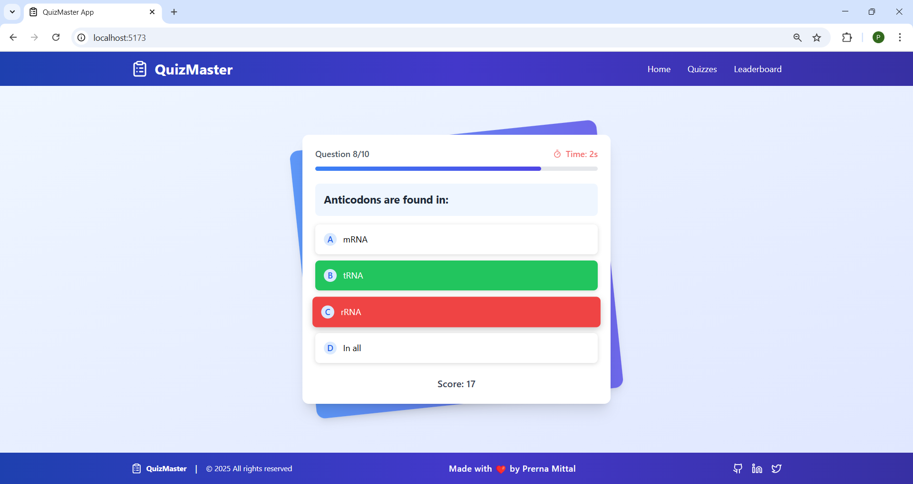
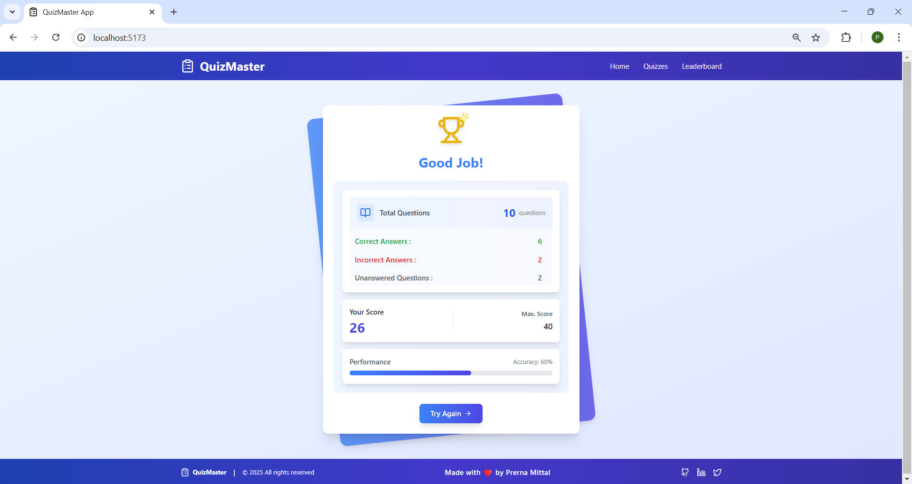

# Interactive Quiz Application

A modern, gamified quiz application built with React and Tailwind CSS that delivers an engaging user experience through interactive features and smooth animations.

## 🌟 Features

### Core Functionality
- Dynamic quiz data fetching and parsing from API
- Subject and topic display
- Single-question interface with multiple-choice answers
- Real-time score tracking
- Comprehensive results summary

### Gamification Elements
- ⏳ 15-second countdown timer per question with visual warning
- 🎯 Advanced points system
  - +4 points for correct answers
  - -1 point for incorrect answers
- 📊 Dynamic progress bar
- ✨ Smooth animations and transitions
  - Button hover effects
  - Answer selection feedback
  - Progress bar transitions
  - Timer warning animations
- 🎨 Modern, responsive design with gradient effects

## 🛠 Technical Implementation

### Installation
```bash
# Clone the repository
git clone https://github.com/mprerna624/Quiz-App.git
cd quiz-app

# Install dependencies
npm install

# Run the development server
npm run dev
```

### Key Components

1. **Data Management**
   - Robust API integration with error handling
   - Efficient state management using React hooks

2. **User Interface**
   - Clean, intuitive design
   - Responsive layout
   - Visual feedback for user actions
   - Progress tracking
   - Animated transitions

3. **Game Mechanics**
   - Timer system with visual warnings
   - Point calculation
   - Progress tracking
   - Answer validation

4. **Performance Optimizations**
   - Efficient re-rendering
   - Smooth animations
   - Responsive design
   - Error boundaries

## 📱 Screenshots

1. Loading Screen (While data is fetching)

    

    ---

2. Start Quiz Screen

    

3. Question Card interface with answer feedback states & timer warning

    
    ---

4. Results Screen

    


---